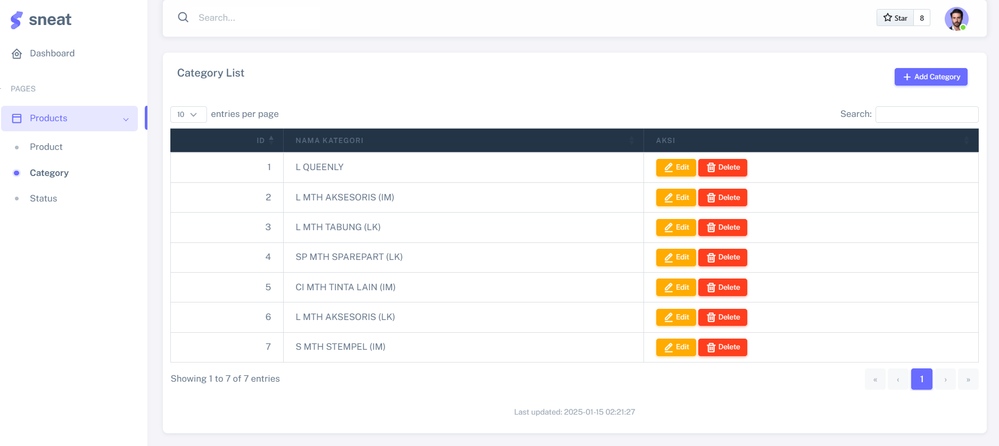

# Didik Ariyanto - Fast Print Programmer Test

#### How To Install

<p></p>

#### Clone Project

```bash
git clone git@github.com:didikari/fast-print-test.git fast-print
```

#### Navigate to Project Directory

To access your project directory, use the `cd` command followed by your project folder name:

```bash
cd fast-print
```

#### Install composer

To install the required dependencies for your codeigniter project, use Composer to install them:

```bash
composer install
```

#### Create ENV

To create a .env file for the production environment, copy the example .env.example file:

```bash
cp .env.example .env
```
### Setting Up Database Configuration for Development and Testing

To configure the database for your Codeigniter project, follow these steps:

---

#### 1. Configure `.env`

Edit the `.env` file in the root of your Codeigniter project to set up the databaset. Add the following lines:

```bash
DB_HOSTNAME="localhost"
DB_USERNAME="your_username"
DB_PASSWORD="your_password"
DB_DATABASE="your_database"
DB_DRIVER="mysqli"
```
#### Option 1. Migrate

To create the database tables defined in your migration files, use the following command:

```bash
php index.php migrate
```
After running the migration, the Product menu will automatically sync, and the data will be inserted into the relevant tables. This ensures that your database is up-to-date with the latest structure and data.

#### Option 2. Import database with data

import database files, use the following command:

```bash
cd database

mysql -u username -p nama_database < fast_print_test.sql
```


## Screenshots

### Product View


### Category View


### Status View

